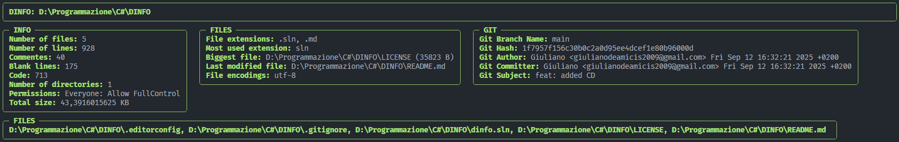

<div align="center">

# DINFO (Directory Info)

**Dinfo** is a C# tool that provides detailed information about a directory.
It uses **Spectre.Console** to create a clean and colorful TUI, showing files, lines, size, permissions, and file type statistics.


## Where to download

<a href="https://apps.microsoft.com/detail/9N2DTJM04TXF?referrer=appbadge&cid=github-repo&mode=full">
    
</a>

</div>

## 🚀 Features

- Counts the number of **files** and **directories**.
- Counts the number of **lines of code, comment and blank lines** in files.
- Shows the **total size** of the directory.
- Displays **permissions** of the directory.
- Lists all **file extensions** and shows the **most used extension**.
- Supports **recursive** processing of subdirectories (`-r`).
- **Verbose mode** (`-v`) for more detailed information.
- Elegant text-based interface with borders, tables, and colors via **Spectre.Console**.
- Save the output in a **.json** or **.yaml** file.
- **Config file support**: now you can use a dinfo.yaml file to specify options.
- **Ignore files and directories**: specify patterns in the config file to automatically skip certain files or folders (using regex!).

---

## 💻 Installation

### 🔧 Manual

1. Clone the repository:

    ```bash
    git clone https://github.com/SCSDC-co/DINFO.git
    ```

2. Build with .NET:

    ```bash
    dotnet build # you need to be in src/tui for running this command
    ```

3. Run the tool:

    ```bash
    dotnet run -- [directory] [options]  # same for this one
    ```

### 📦 Package

1. You Can install the package with an AUR helper like `yay` or `paru`.

    ```bash
    yay -S dinfo
    paru -S dinfo
    ```

---

## ❓ Help Page

```bash
dinfo.tui v1.0.0

USAGE
  dinfo.tui <targetdirectory> [options]
  dinfo.tui [command] [...]

DESCRIPTION
  Display information about the specified directory and its contents.

PARAMETERS
  targetdirectory   The Directory to be analyzed. Default: Current Directory.

OPTIONS
  -r|--recursive    Recursively list all files and directories. Default: "False".
  -v|--verbose      Enable verbose output. Default: "False".
  -i|--ignore-gitignore  Ignore .gitignore files. Default: "False".
  -o|--output       Specify if you want the output in a file. Default: "False".
  -f|--file-format  Specify the output file (formats: json, yaml). Default: "output.json".
  -n|--no-tui       Disable TUI Default: "False".
  -h|--help         Shows help text.
  --version         Shows version information.

COMMANDS
  file              Display information about the specified file.

You can run `dinfo.tui [command] --help` to show help on a specific command.
```

**Example:**

```bash
# Get the information about the current directory
dinfo

# Get the information about a specific directory with rucursive processing
dinfo C:\Projects\MyFolder -r

# Get the information about a specific directory with verbose output
dinfo C:\Projects\MyFolder -v

# Save the output in ./output.json
dinfo C:\Projects\MyFolder -o

# Save the output in C:\dinfo-outputs\output1.json
dinfo C:\Projects\MyFolder -o -f C:\dinfo-outputs\output1.json
```

---

## 🖼️ Exampls Output (verbose)



---

## 🛠️ Configuration example:

```yaml
# dinfo.yaml
recursive: true
verbose: true
ignore_gitignore: false

ignored_files_or_directories:
  ignored_files:
    - "README.md"
    - "*.log"

  ignored_directories:
    - "node_modules"
    - ".git"
```

---

## ⚡ Technologies

- [C#](https://docs.microsoft.com/en-us/dotnet/csharp/) - the main language of the program
- [Spectre.Console](https://spectreconsole.net/) - for TUI and colored output
- [CliFx](https://github.com/Tyrrrz/CliFx) - for command-line parsing
- [GitReader](https://github.com/kekyo/GitReader) - for getting git informations
- [MAB.DotIgnore](https://github.com/markashleybell/MAB.DotIgnore) - for .gitignore parsing
- [YamlDotNet](https://github.com/aaubry/YamlDotNet) - for yaml serialization and parsing

---

## 📝 Notes

- Dinfo is designed to be **lightweight, fast, and simple**.
- Ideal for developers who want to **count lines of code** or get a quick overview of a directory.

---

## 🤝 Contributing

Contributions are welcome! Open a **pull request** or create an **issue** for suggestions or bug reports.

---

## Roadmap

- [ ] Adding more output types:
  - [x] html
  - [ ] database
- [ ] Adding a tree making system of the directory via flags

---

## 📜 License


This project is licensed under the **GNU GPL v3.0**. See the [LICENSE](LICENSE) file for details.

